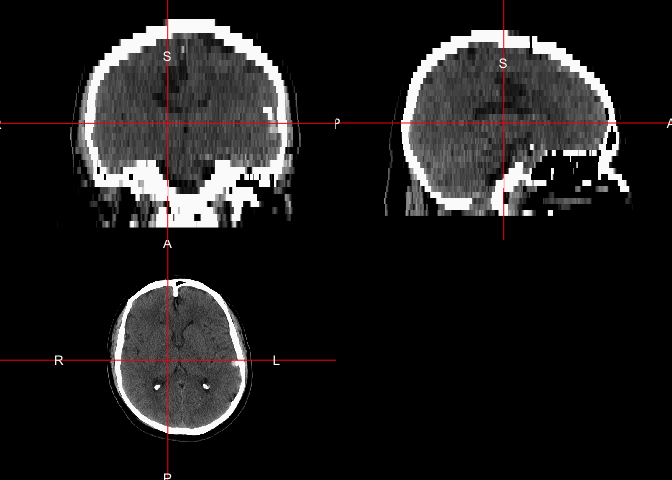
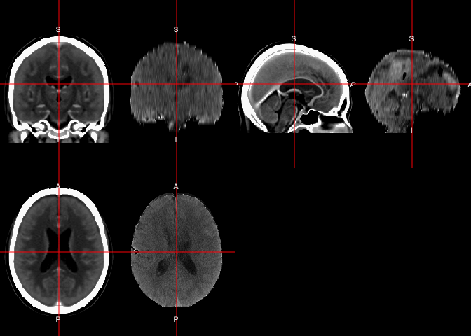
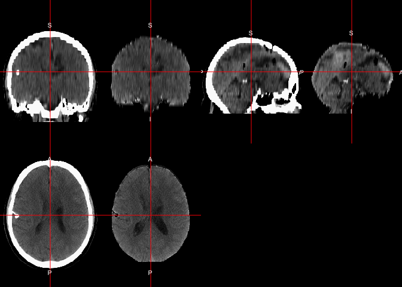

# Goal
In this tutorial, we will discuss skull-stripping (or brain-extracting) X-ray computed tomography (CT) scans.  We will use data from TCIA (http://www.cancerimagingarchive.net/).  The entire pipeline goes from raw DICOM data, converts it to NIfTI images, performs brain extraction, and then spatially normalizes the brain to a template using non-linear registration.  All of the packages are open source and are available through [CRAN](https://cran.r-project.org/) or [Neuroconductor (https://neuroconductor.org/)](https://neuroconductor.org/) for the R programming language.  We extract data from TCIA from the [`TCIApathfinder`](https://CRAN.R-project.org/package=TCIApathfinder) R package.

## Installing Packages

In order to run all the code in this tutorial, these packages need to be installed.  The following code should install all the packages. 


```r
install.packages(c("TCIApathfinder", "dplyr"))
source("https://neuroconductor.org/neurocLite.R") 
neuro_install(c("dcm2niir", "ichseg", "fslr", "extrantsr"))
```


## Using TCIApathfinder

In order to use `TCIApathfinder`, please see the [vignette to obtain API keys](https://cran.r-project.org/web/packages/TCIApathfinder/vignettes/introduction.html) [@TCIApathfinder].  Here we will look at the collections of data available givent the code below:


```r
library(TCIApathfinder)
library(dplyr)
```

```

Attaching package: 'dplyr'
```

```
The following object is masked from 'package:oro.nifti':

    slice
```

```
The following objects are masked from 'package:stats':

    filter, lag
```

```
The following objects are masked from 'package:base':

    intersect, setdiff, setequal, union
```

```r
series_instance_uid = "1.3.6.1.4.1.14519.5.2.1.2857.3707.893926543922125108620513439908"
download_unzip_series = function(series_instance_uid,
                                 verbose = TRUE) {
  tdir = tempfile()
  dir.create(tdir, recursive = TRUE)
  tfile = tempfile(fileext = ".zip")
  tfile = basename(tfile)
  if (verbose) {
    message("Downloading Series")
  }
  res = save_image_series(
    series_instance_uid = series_instance_uid, 
    out_dir = tdir, 
    out_file_name = tfile)
  if (verbose) {
    message("Unzipping Series")
  }  
  stopifnot(file.exists(res$out_file))
  tdir = tempfile()
  dir.create(tdir, recursive = TRUE)
  res = unzip(zipfile = res$out_file, exdir = tdir)
  L = list(files = res,
           dirs = unique(dirname(normalizePath(res))))
  return(L)
}
# Download and unzip the image series

file_list = download_unzip_series(
  series_instance_uid = series_instance_uid)
```

```
Downloading Series
```

```
Unzipping Series
```

Here we extracted a single series of a CT brain scan.  The data are in DICOM format.

## Converting DICOM to NIfTI

We will use [`dcm2niix`](https://github.com/rordenlab/dcm2niix) to convert the data from DICOM to NIfTI.  The function `dcm2niix` is wrapped in the `dcm2niir` R package [@dcm2niir].  We will use `dcm2niir::dcm2nii` to convert the file.  We use `check_dcm2nii` to grab the relevant output files:
 

```r
library(dcm2niir)
dcm_result = dcm2nii(file_list$dirs)
```

```
#Copying Files
```

```
# Converting to nii 
```

```
'/Library/Frameworks/R.framework/Versions/3.6/Resources/library/dcm2niir/dcm2niix' -9 -z y -f %p_%t_%s '/var/folders/1s/wrtqcpxn685_zk570bnx9_rr0000gr/T//Rtmp5zn4fm/file90e86ff1b312'
```

```r
dcm_result$nii_after
```

```
[1] "/var/folders/1s/wrtqcpxn685_zk570bnx9_rr0000gr/T//Rtmp5zn4fm/file90e86ff1b312/HEAD_STD_20010124161800_2_Tilt_1.nii.gz"
[2] "/var/folders/1s/wrtqcpxn685_zk570bnx9_rr0000gr/T//Rtmp5zn4fm/file90e86ff1b312/HEAD_STD_20010124161800_2.nii.gz"       
```

```r
result = check_dcm2nii(dcm_result)
result
```

```
[1] "/var/folders/1s/wrtqcpxn685_zk570bnx9_rr0000gr/T//Rtmp5zn4fm/file90e86ff1b312/HEAD_STD_20010124161800_2_Tilt_1.nii.gz"
attr(,"json_file")
[1] "/var/folders/1s/wrtqcpxn685_zk570bnx9_rr0000gr/T//Rtmp5zn4fm/file90e86ff1b312/HEAD_STD_20010124161800_2.json"
```
Here we see the output is a single NIfTI file.  If there is any gantry tilt or variable slice thickness, `dcm2niix` has accounted for this.  

Next we read the data into `R` into a `nifti` object:

```r
library(neurobase)
img = readnii(result)
ortho2(img)
```

<!-- -->

```r
range(img)
```

```
[1] -3024  3071
```

Here we will use `neurobase::rescale_img` to make sure the minimum is $-1024$ and the maximum is $3071$.  The minimum can be lower for areas outside the field of view (FOV).  Here we plot the image and the Winsorized version to see the brain tissue:


```r
img = rescale_img(img, min.val = -1024, max.val = 3071)
ortho2(img)
```

<!-- -->

```r
ortho2(img, window = c(0, 100))
```

<!-- -->

We see the image has high resolution within the axial plane, but not as high resolution in the sagittal plane.  We see high values in the skull and other dense areas and lower values within the brain and the darkest values outside of the head.

## Skull Strip

We can skull strip the image using `CT_Skull_Strip` or `CT_Skull_Stripper` from the `ichseg` R package.  The `CT_Skull_Stripper` has a simple switch to use `CT_Skull_Strip` or `CT_Skull_Strip_robust` [@ichseg].  

```r
library(ichseg)
ss = CT_Skull_Strip(img, verbose = FALSE)
```

```
Warning in get.fsl(): Setting fsl.path to /usr/local/fsl
```

```
Warning in get.fsloutput(): Can't find FSLOUTPUTTYPE, setting to NIFTI_GZ
```

```r
ortho2(img, ss > 0, 
       window = c(0, 100),
       col.y = scales::alpha("red", 0.5))
```

<!-- -->

The `CT_Skull_Strip_robust` function does 2 neck removals using `remove_neck` from `extrantsr` and then find the center of gravity (COG) twice to make sure the segmentation focuses on the head, which uses some FSL [@fsl] functions in the `fslr` package [@fslr].  In some instances, the whole neck is included in the scan, such as some of the head-neck studies in TCIA.

## Registration

Here we register the image to the template image from Rorden (2012).  We will use the `registration` function from the `extrantsr` R package [@extrantsr].  The `extrantsr` package uses the `ANTsR` R package to perform the registration, and simply wraps multiple commands together [@ANTsR].  We will use a Symmetric Normalization (SyN) type of registration, which first uses an affine registration, then combines it with a symmetric non-linear diffeomorphism.  The output file `reg$outfile` is the registered image.


```r
template_image = ichseg::ct_template(type = "image")
ortho2(template_image, window = c(0, 100))
```

<!-- -->

```r
reg = extrantsr::registration(
  img, template.file = template_image, 
  typeofTransform = "SyN", 
  interpolator = "Linear")
```

```
# Running Registration of file to template
```

```
# Applying Registration output is
```

```
$fwdtransforms
[1] "/var/folders/1s/wrtqcpxn685_zk570bnx9_rr0000gr/T//Rtmp5zn4fm/file90e81554bff81Warp.nii.gz"      
[2] "/var/folders/1s/wrtqcpxn685_zk570bnx9_rr0000gr/T//Rtmp5zn4fm/file90e81554bff80GenericAffine.mat"

$invtransforms
[1] "/var/folders/1s/wrtqcpxn685_zk570bnx9_rr0000gr/T//Rtmp5zn4fm/file90e81554bff80GenericAffine.mat" 
[2] "/var/folders/1s/wrtqcpxn685_zk570bnx9_rr0000gr/T//Rtmp5zn4fm/file90e81554bff81InverseWarp.nii.gz"

$prev_transforms
character(0)
```

```
# Applying Transformations to file
```

```
 [1] "-d"                                                                                             
 [2] "3"                                                                                              
 [3] "-i"                                                                                             
 [4] "<pointer: 0x7fcac8fe1c20>"                                                                      
 [5] "-o"                                                                                             
 [6] "<pointer: 0x7fcac8fb3c70>"                                                                      
 [7] "-r"                                                                                             
 [8] "<pointer: 0x7fcab4c0b2f0>"                                                                      
 [9] "-n"                                                                                             
[10] "linear"                                                                                         
[11] "-t"                                                                                             
[12] "/var/folders/1s/wrtqcpxn685_zk570bnx9_rr0000gr/T//Rtmp5zn4fm/file90e81554bff81Warp.nii.gz"      
[13] "-t"                                                                                             
[14] "/var/folders/1s/wrtqcpxn685_zk570bnx9_rr0000gr/T//Rtmp5zn4fm/file90e81554bff80GenericAffine.mat"
```

```
# Writing out file
```

```
[1] "/var/folders/1s/wrtqcpxn685_zk570bnx9_rr0000gr/T//Rtmp5zn4fm/file90e86c15f438.nii.gz"
```

```
# Reading data back into R
```

```r
wimg = window_img(reg$outfile, window = c(0, 100))
double_ortho(template_image, wimg, window = c(0, 100))
```

<!-- -->
We see relatively good alignment between the template image (left) and the registered image (right)

Here we will use the skull-stripped template and perform the same registration with the skull-stripped image.  

```r
template_brain = ichseg::ct_template(type = "brain")
ortho2(template_brain, window = c(0, 100))
```

<!-- -->

```r
brain_reg = extrantsr::registration(
  ss, template.file = template_brain, 
  typeofTransform = "SyN", 
  interpolator = "Linear")
```

```
# Running Registration of file to template
```

```
# Applying Registration output is
```

```
$fwdtransforms
[1] "/var/folders/1s/wrtqcpxn685_zk570bnx9_rr0000gr/T//Rtmp5zn4fm/file90e87a2ad82c1Warp.nii.gz"      
[2] "/var/folders/1s/wrtqcpxn685_zk570bnx9_rr0000gr/T//Rtmp5zn4fm/file90e87a2ad82c0GenericAffine.mat"

$invtransforms
[1] "/var/folders/1s/wrtqcpxn685_zk570bnx9_rr0000gr/T//Rtmp5zn4fm/file90e87a2ad82c0GenericAffine.mat" 
[2] "/var/folders/1s/wrtqcpxn685_zk570bnx9_rr0000gr/T//Rtmp5zn4fm/file90e87a2ad82c1InverseWarp.nii.gz"

$prev_transforms
character(0)
```

```
# Applying Transformations to file
```

```
 [1] "-d"                                                                                             
 [2] "3"                                                                                              
 [3] "-i"                                                                                             
 [4] "<pointer: 0x7fcab4e8ad90>"                                                                      
 [5] "-o"                                                                                             
 [6] "<pointer: 0x7fcad0a6c660>"                                                                      
 [7] "-r"                                                                                             
 [8] "<pointer: 0x7fcab4e46050>"                                                                      
 [9] "-n"                                                                                             
[10] "linear"                                                                                         
[11] "-t"                                                                                             
[12] "/var/folders/1s/wrtqcpxn685_zk570bnx9_rr0000gr/T//Rtmp5zn4fm/file90e87a2ad82c1Warp.nii.gz"      
[13] "-t"                                                                                             
[14] "/var/folders/1s/wrtqcpxn685_zk570bnx9_rr0000gr/T//Rtmp5zn4fm/file90e87a2ad82c0GenericAffine.mat"
```

```
# Writing out file
```

```
[1] "/var/folders/1s/wrtqcpxn685_zk570bnx9_rr0000gr/T//Rtmp5zn4fm/file90e8141912f2.nii.gz"
```

```
# Reading data back into R
```

```r
wbrain = window_img(brain_reg$outfile, window = c(0, 100))
double_ortho(template_image, wbrain, window = c(0, 100))
```

<!-- -->

We see again good alignment, but we see that there are some stark differences in these registrations when we compare them:


```r
double_ortho(wimg, wbrain)
```

<!-- -->
